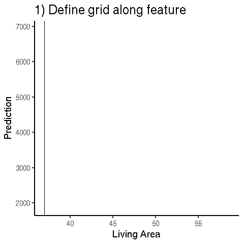

## Machine Learning vs Programing {.center data-background=../images/programing-ml.png data-background-size=contain}

## Machine Learning vs Statistics  {.emphasizedabit}

linear $\Rightarrow$ non-linear

additive $\Rightarrow$ interactions

theory-driven $\Rightarrow$ optimization-driven

## Machine Learning Model  {.center data-background=../images/graph.png data-background-size=contain}

## Black Box Problem

## {.center data-background=../images/explain.png data-background-size=contain}

## Example: Predict Rent {.center data-background=../images/rent-ml.png data-background-size=contain}

## Feature Effect {.center data-background=../images/pdp-rent.png data-background-size=contain}

## Feature Effect: Partial Dependence Plot

## Feature Importance {.center data-background=../images/feature-importance-rent.png data-background-size=contain}

## Permutation Feature Importance {.center data-background=../images/permimp-shuffle.png data-background-size=contain}

## Counterfactual Explanations {.center data-background=../images/rent.png data-background-size=contain}

## Shapley Value {.center data-background=../images/shapley-rent.png data-background-size=contain}

## Intepretable Model: Linear Regression {.center data-background=../images/lm.png data-background-size=contain}

## Intepretable Model: Decision Tree {.center data-background=../images/tree.png data-background-size=contain}

## Interpretable Model: Decision Rules {.emphasizedabit}

IF $90m^2\leq \text{size} < 110m^2$  AND location $=$ "good" THEN rent is between 1540 and 1890 EUR

## Global Surrogate {.center data-background=../images/global-surrogate.png data-background-size=contain}

## Local Surrogate {.center data-background=../images/local-surrogate.png data-background-size=contain}

# Causality?

## Machine Learning Model  {.center data-background=../images/graph.png data-background-size=contain}

##   {.center data-background=../images/ladder-causality.png data-background-size=contain}

## {.center data-background=../images/ladder-causality-0.png data-background-size=contain}

## Some thoughts on causality

- "All other variables are held constant" $\Rightarrow$ same for interpretation methods
- Interpretation methods suffer from correlation
- Interpretability as building block for causality? (e.g. PDP is equivalent of linear model weights)
- do-calculus for non-linear models?
- PDP shows causal feature effects (intervention) if ML model is causal
- Inherent conflict between predictive performance and causality (e.g. add confounders to improve performance)

<!--
## Example

- ML model predicts shoe size
- Features height and weight correlated (height causal for weight)
- We analyse model effect / importance of height on shoe size
- Involves creating unrealistic people (2m, 50kg)
- Weight is not changed based on height
- Always measures direct effect, but not total (bc. excludes indirect effect)
- Model not causal DAG

-->

## Further readings   
More on interpretable machine learning in my book [http://christophm.github.io/interpretable-ml-book/](http://christophm.github.io/interpretable-ml-book/).

