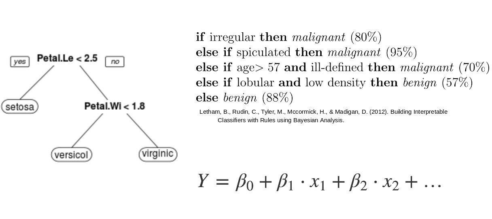
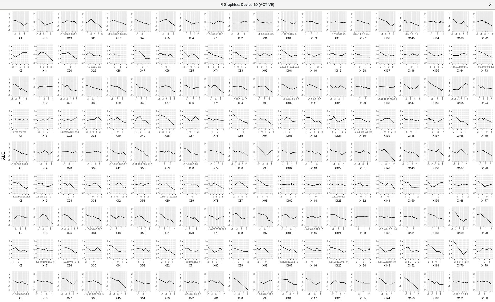

```{r, include = FALSE}
knitr::opts_chunk$set(echo = FALSE, 
  warning = FALSE,
  message = FALSE, 
  fig.align='center', 
  out.width = '90%',
  dev = "CairoPNG")

ggplot2::theme_set(ggplot2::theme_bw(base_size = 15))
```

## Black Box problem


```{r, echo = FALSE}
knitr::include_graphics("../images/black-box.png")
```

## Solution 1: Interpretable Model

```{r, echo=FALSE}
knitr::include_graphics("../images/white-box.png")
```

## But: Peformance low and how to compare interpretability?

```{r}

```

## Solution 2: Post-Hoc Analysis

```{r, echo=FALSE}
knitr::include_graphics("../images/agnostic-black-box.png")
```

## But: Verbose and unreliable {.center data-background=../images/pdp-multiple.png}

```{r, eval=FALSE}
library('iml')
dat = data.frame(matrix(rnorm(1800), ncol = 180))
pred.fun = function(newdata, object){
	data.frame(y = sin(rowSums(newdata)) + rnorm(nrow(newdata), sd = 0.1))
}
pred = Predictor$new(data = dat, predict.fun = pred.fun)
fes = FeatureEffects$new(pred)
fes$plot(ncol = 20)
```
```{r eval=FALSE}

```


## Solution 3: Compare models with interpretability / complexity measures

TODO: Image with 3 black boxes and numbers attached to it

## Desiderata

- Few features (Sparsity)
- Few interactions (Additivity)
- Simple relationships (Simplicity)
  
## Measure: Number of features heuristic

TODO: Visualisation of algorithm

## Functional Decomposition

TODO: Formula with decomposition

## Accumulated Local Effects (ALE)

```{r}
knitr::include_graphics("../images/ale-intuition-3.jpg")
```


## Functional Decomposition with ALE

TODO: copy paste new decomposition

## Measure: Interaction Strength

TODO: PRL formula with R2 and SSQ and so on

## Measure: Complexity

TODO: AleNumApprox plot

## Measure: Complexity cont.

TODO: Multiple AleNumApprox plots with averaging formula

## Application: Multi-Objective Optimization

TODO: Wine plot
TODO: List of models 

## Application: Multi-Objective Optimization

TODO: Show result graphics

## Application: Multi-Objective Optimization

TODO: Show Interpretability vs. Performance Tradeoff

```{r child = "../chunks/book.Rmd"}
```


# Backup

## Units in Wine dataset

- fixed acidity g(tartaric acid)/dm^3^
- volatile acidity: g(acetric acid/dm^3^)
- citric acid: g/dm^3^
- residual sugar: g/dm^3^
- chlorides: g(sodium chloride)/dm^3^
- free sulfur dioxide: mg/dm^3^
- total sulfur dioxide: mg/dm^3^
- density> g/cm^3^
- pH
- sulphates: g(postassium sulphate) / dm^3^
- alcohol vol.%

