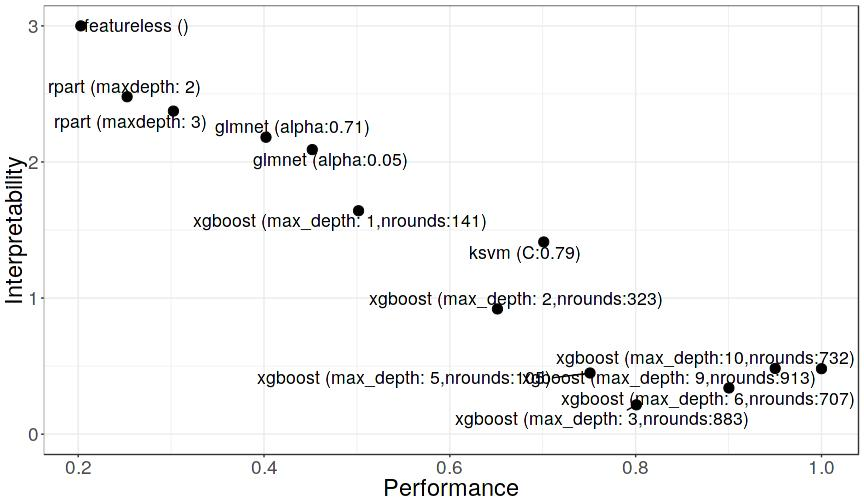

```{r, include = FALSE}
knitr::opts_chunk$set(echo = FALSE, 
  warning = FALSE,
  message = FALSE, 
  fig.align='center', 
  out.width = '90%',
  dev = "CairoPNG")

ggplot2::theme_set(ggplot2::theme_bw(base_size = 15))
```

## Black Box Problem

```{r, echo = FALSE}
knitr::include_graphics("../images/black-box.png")
```
## Problem: Tradeoff interpretability and performance
Use only interpretable models (e.g. linear model)! 

$\Rightarrow$ Pay with loss in performance.

```{r, echo = FALSE}
knitr::include_graphics("../images/white-box.png")
```
## Problem: Tradeoff interpretability and performance
Just use post-hoc interpretation methods (e.g. feature importance)! 

$\Rightarrow$ Works better for less complex models.

```{r, echo=FALSE}
knitr::include_graphics("../images/agnostic-black-box.png")
```

## What's interpretability anyway?

```{r}

```

## We propose measures of model complexity

Measure model complexity in a model-agnostic way: number of features, interaction strength, main effect complexity

$\Rightarrow$ Allows model comparision

$\Rightarrow$ Allows direct optimization for interpretability

$\Rightarrow$ Makes claims of interpretability more explicit ("Model A uses less features than B and has less interactions")


## Functional Decomposition

$$f(x) = \overbrace{f_0}^\text{Intercept} + \overbrace{\sum_{j=1}^p f_j(x_j)}^\text{1st order effects} + \overbrace{\sum_{j\neq k}^p f_{jk}(x_j, x_k)}^\text{2nd order effects} + \ldots + \overbrace{f_{1,\ldots,p}(x_1, \ldots, x_p)}^\text{p-th order effect}
$$


## Functional Decomposition
$$f(x)  = \overbrace{f_0}^\text{Intercept} + \overbrace{\sum_{j=1}^p f_j(x_j)}^\text{1st order effects} + \overbrace{\sum_{S \subseteq \{1,\ldots,p\},|S| \geq 2} f_{S}(x_S)}^{\text{Higher order effects}}
$$

## Functional Decomposition 

$$f(x)  = \underbrace{f_0 + \sum_{j=1}^p \overbrace{f_j(x_j)}^\text{How complex?} + \overbrace{IA(x)}^{\text{How much interaction?}}}_{\text{How many feature used?}}$$

## Accumulated Local Effects (ALE)

```{r}
knitr::include_graphics("../images/ale-intuition-1.jpg")
```
## Accumulated Local Effects (ALE)

```{r}
knitr::include_graphics("../images/ale-intuition-2.jpg")
```

## Accumulated Local Effects (ALE)

```{r}

```

## Accumulated Local Effects (ALE)

```{r}
knitr::include_graphics("../images/ale-intuition-4.jpg")
```
## Accumulated Local Effects (ALE)

```{r}
knitr::include_graphics("../images/ale-intuition-5.jpg")
```


## Main effect complexity

- Approximate ALE plot with linear segments
- Count number of non-zero coefficients
- Average over all features, weight with variance

```{r}

```
## Interaction Strength

Measure main effect model with proportion of error explained:


$$\text{Interaction Strength} =  \frac{\mathbb{E}(L(\hat{f}, f_0 + \sum_{j=1}^p f_j)}{\mathbb{E}(L(\hat{f}, c))}$$

## Application: Multi-Objective Optimization

- Predict wine quality from phsicochemical properties
- Minimize MAE, number of features, interaction strength, main effect complexity
- Search across different model classes and hyperparameter settings  

```{r, out.width = "70%"}
knitr::include_graphics("../images/wine-features.jpg")
```


## Application: Multi-Objective Optimization

```{r}

```


## Application: Multi-Objective Optimization

```{r, out.width='70%'}

```


## Interested in interpretable machine learning?
More on interpretable machine learning in my book [http://christophm.github.io/interpretable-ml-book/](http://christophm.github.io/interpretable-ml-book/).

```{r, out.width="5cm"}
knitr::include_graphics("../images/cover-bordered.jpg")
```

