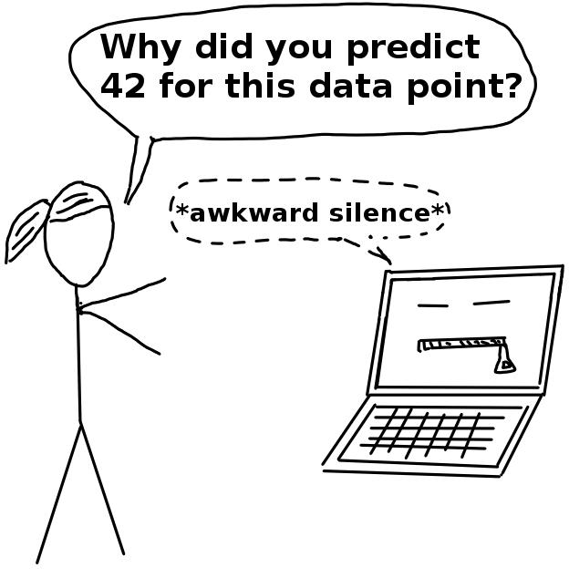

```{r, include = FALSE}
knitr::opts_chunk$set(echo = FALSE, 
  warning = FALSE,
  message = FALSE, 
  fig.align='center', 
  out.width = '95%')
```

## Machine Learning (supervised)

```{r, echo=FALSE}
knitr::include_graphics("../images/black-box.png")
```

## Machine Learning vs Programing {.center data-background=../images/programing-ml.png data-background-size=contain}


## Machine Learning vs Statistics  {.emphasizedabit}

linear $\Rightarrow$ non-linear

additive $\Rightarrow$ interactions

theory-driven $\Rightarrow$ optimization-driven


## Black Box Problem




```{r, child="../chunks/story-wines.Rmd"}
```

## Why interpretability? 

## {.center data-background=../images/explain.png data-background-size=contain}

```{r, child="../chunks/tools.Rmd"}
```

```{r child = "../chunks/book.Rmd"}
```


# Backup slides

## LRP

## LIME for images

## LIME for text

## Units in Wine dataset

- fixed acidity g(tartaric acid)/dm^3^
- volatile acidity: g(acetric acid/dm^3^)
- citric acid: g/dm^3^
- residual sugar: g/dm^3^
- chlorides: g(sodium chloride)/dm^3^
- free sulfur dioxide: mg/dm^3^
- total sulfur dioxide: mg/dm^3^
- density> g/cm^3^
- pH
- sulphates: g(postassium sulphate) / dm^3^
- alcohol vol.%
- quality based on sensory data (0-10)
