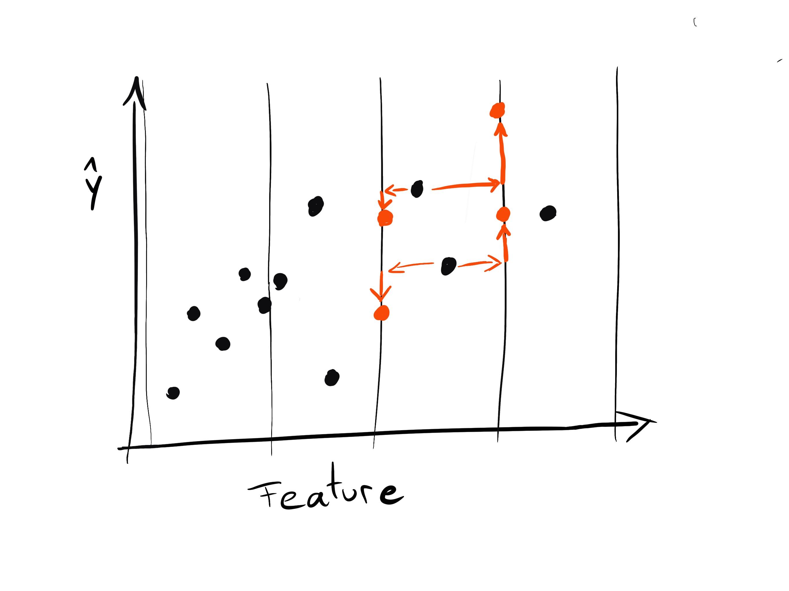

```{r, include = FALSE}
knitr::opts_chunk$set(echo = FALSE, 
  warning = FALSE,
  message = FALSE, 
  fig.align='center', 
  out.width = '90%',
  dev = "CairoPNG")

ggplot2::theme_set(ggplot2::theme_bw(base_size = 15))
```

## Outline

- Minimizing model complexity maximizes interpretability
- Functional Decomposition
- Measures
- Application

## Black Box Problem

```{r, echo = FALSE}
knitr::include_graphics("../images/black-box.png")
```

## Solution: Post-hoc Interpretation? 

<!-- $\Rightarrow$ Post-hoc interpretation (e.g. feature importance, partial dependence plots) works better for less complex models. -->

```{r, echo=FALSE}
knitr::include_graphics("../images/agnostic-black-box.png")
```

## Sparsity Improves Interpretation

TODO: Image of 3 vs 100 feature in importance

## Additivity Improves Interpretation

TODO: Image from paper with PDP and increasing interactions

## Linearity Improves Interpretation

TODO: Image with increasing MEC

## We Propose Measures of Model Complexity

Measure model complexity in a model-agnostic way: number of features, interaction strength, main effect complexity

$\Rightarrow$ Allows model comparison

$\Rightarrow$ Allows direct optimization for interpretability

$\Rightarrow$ Allows choosing models with improved post-hoc interpretation


## Functional Decomposition

$$f(x) = \overbrace{f_0}^\text{Intercept} + \overbrace{\sum_{j=1}^p f_j(x_j)}^\text{1st order effects} + \overbrace{\sum_{j\neq k}^p f_{jk}(x_j, x_k)}^\text{2nd order effects} + \ldots + \overbrace{f_{1,\ldots,p}(x_1, \ldots, x_p)}^\text{p-th order effect}
$$


## Functional Decomposition
$$f(x)  = \overbrace{f_0}^\text{Intercept} + \overbrace{\sum_{j=1}^p f_j(x_j)}^\text{1st order effects} + \overbrace{\sum_{S \subseteq \{1,\ldots,p\},|S| \geq 2} f_{S}(x_S)}^{\text{Higher order effects}}
$$

## Functional Decomposition 

$$f(x)  = \underbrace{f_0 + \sum_{j=1}^p \overbrace{f_j(x_j)}^\text{How complex?} + \overbrace{IA(x)}^{\text{How much interaction?}}}_{\text{How many feature used?}}$$

## Accumulated Local Effects (ALE)

```{r}
knitr::include_graphics("../images/ale-intuition-1.jpg")
```
## Accumulated Local Effects (ALE)

```{r}

```

## Accumulated Local Effects (ALE)

```{r}
knitr::include_graphics("../images/ale-intuition-3.jpg")
```

## Accumulated Local Effects (ALE)

```{r}
knitr::include_graphics("../images/ale-intuition-4.jpg")
```
## Accumulated Local Effects (ALE)

```{r}
knitr::include_graphics("../images/ale-intuition-5.jpg")
```


## Main effect complexity

- Approximate ALE plot with linear segments
- Count number of non-zero coefficients
- Average over all features, weight with variance

```{r}
knitr::include_graphics("../images/c-demo-1.jpeg")
```
## Interaction Strength

Measure main effect model with proportion of error explained:


$$\text{Interaction Strength} =  \frac{\mathbb{E}(L(\hat{f}, f_0 + \sum_{j=1}^p f_j))}{\mathbb{E}(L(\hat{f}, c))}$$

## Application: Multi-Objective Optimization

- Predict wine quality from physicochemical properties
- Minimize MAE, number of features, interaction strength, main effect complexity
- Search across different model classes and hyperparameter settings  

```{r, out.width = "70%"}
knitr::include_graphics("../images/wine-features.jpg")
```


## Application: Multi-Objective Optimization

```{r, out.width='70%'}
knitr::include_graphics("../images/multi-obj-selection.png")
```

## Summary

- Model-agnostic complexity measures: number of features, interaction strength, main effect complexity
- Use: model comparison and optimization metric
 

- Implementation: \url{https://github.com/compstat-lmu/paper_2019_iml_measures}
- Paper:[https://arxiv.org/abs/1904.03867]()

# The End


## Why not GAM?

```{r echo = TRUE}
library("mgcv")
library("iml")
set.seed(42)
X = data.frame(x1 = rnorm(100), x2 = rnorm(100))
f = function(model = NULL, newdata) {
	1 *  (newdata[,1] > 0)
}
y = f(newdata = X)
dat = cbind(y, X)
mod.gam = gam(y ~ s(x1) + s(x2), data = dat)

```

## Why not GAM?

```{r fig.height = 5}
plot(mod.gam)
```


## Why not GAM?

```{r}
pred = Predictor$new(predict.fun = f, data = X)
fes = FeatureEffects$new(pred)
plot(fes, ncol = 2)
```


