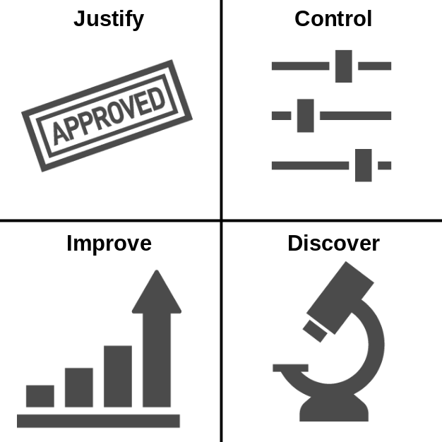

```{r, include = FALSE}
knitr::opts_chunk$set(echo = FALSE,
  warning = FALSE,
  message = FALSE,
  fig.align='center',
  out.width = '90%',
  dev = "CairoPNG")

ggplot2::theme_set(ggplot2::theme_bw(base_size = 15))
```


## Outline

- Introduction
  - Brief History of Interpretability
  - What Is Model-Agnostic Interpretability?
  - Partial Dependence Plot (PDP)
  - Permutation Feature Importance (PFI)
- What I did in my PhD
- Statistical Inference for PDP and PFI

# Introduction

## A Brief History of Interpretable Modeling

Interpretable ML has 200 year old roots, but consolidation only started in 2016.

>- 1800s: Linear regression models
>- 1960s: Rule-based ML
>- 2001:  Random Forest
>- 2012:  Deep Learning Boom kicked off
>- 2016:  Interpretable ML / Explainable AI boom

## A Brief History of Interpretable Modeling

Interpretable ML has 200 year old roots, but consolidation only started in 2016.

TODO: Web Of Science for keywords XAI and IML (written out)


## Why Interpretability?

```{r, out.width = 500}

```


## Interpretable Models

* Decision trees and decision rules
* Generalized additive models and the whole gang of statistical modeling
* Interpretable models allow interpretation of internal structure and parameters.

## Interpretable Models

```{r, echo = FALSE}
knitr::include_graphics("../images/white-box.png")
```


# Model-agnostic Interpretation


## Black Box Models


```{r, echo=FALSE}
knitr::include_graphics("../images/black-box.png")
```

Random forest, gradient-boosted trees, neural networks, ...

## Model-agnostic Interpretation

Basic idea: Treat the model as a black box, not allowed to look inside.

Idea very powerful: Allows modularity, works for most models, results are comparable across models

TODO: CITE SIPA paper here

## Model-agnostic Methods

```{r, echo=FALSE}
knitr::include_graphics("../images/agnostic-black-box.png")
```


# Methodological Background

## Individual Conditional Expectation (ICE)

How does a feature influence the prediction for an individual observation?

## Individual Conditional Expectation (ICE)

How does a feature influence the prediction for an individual observation?

```{r}
load(url("https://github.com/christophM/interpretable-ml-book/blob/master/data/bike.RData?raw=true"))
library("mlr")
library("iml")
library("ggplot2")
library(dplyr)
library(tidyr)

bike.task = makeRegrTask(data = bike, target = "cnt")
mod.bike = mlr::train(mlr::makeLearner(cl = 'regr.randomForest', id = 'bike-rf'), bike.task)

set.seed(42)
bike.sub = bike[sample(1:nrow(bike), size = 15),]

pred.bike = Predictor$new(mod.bike, data = bike.sub)
pdp = FeatureEffect$new(pred.bike, "temp", method = "ice", grid.size = 7)


res.raw = pdp$results
theme_set(theme_classic(base_size = 20))


## Step 1: Define grid over feature
grid.dat = data.frame(temp = unique(res.raw$temp), .id = 1, temp2 = 1)
p = ggplot(grid.dat) + geom_vline(aes(xintercept = temp)) +
  scale_y_continuous("Prediction", limits = c(min(res.raw$.y.hat), max(res.raw$.y.hat))) +
  ggtitle("1) Define grid along feature") +
  scale_x_continuous("Feature")
  #scale_y_continuous("Prediction")
p
```

## Individual Conditional Expectation (ICE)

How does a feature influence the prediction for an individual observation?


```{r}
## Step 2: Get predictions for data set when at grid
grid.dat = data.frame(temp = unique(res.raw$temp))
res.raw$tt = res.raw$temp
p = ggplot(res.raw, aes(x = temp, y = .value)) +
  geom_vline(data = grid.dat, aes(xintercept = temp)) +
  geom_point(aes(color = factor(.id)), size = 3)+
  scale_color_discrete(guide = "none") +
  ggtitle("2) Model predictions at grid points") +
  scale_x_continuous("Feature") +
  scale_y_continuous("Prediction", breaks = NULL)
p
```

## Individual Conditional Expectation (ICE)

How does a feature influence the prediction for an individual observation?


```{r}
res.raw$.id2 = factor(res.raw$.id)
p = ggplot(res.raw, aes(x = temp, y = .value))  +
  #geom_vline(aes(xintercept = temp), data = grid.dat) +
  geom_line(aes(group = .id), size  = 1)  +
  geom_point(data = res.raw[c("temp", ".value", ".id2")], aes(color = .id2), size = 3) +
  scale_color_discrete(guide = "none") +
  ggtitle("3) Line per data instance -> ICE curves") +
  scale_x_continuous("Feature") +
  scale_y_continuous("Prediction", breaks = NULL)
p
```

## Partial Dependence Plot (PDP)

How does a feature influence the prediction for an individual observation **on average**?


## Partial Dependence Plot (PDP)

How does a feature influence the prediction for an individual observation **on average**?

```{r}
p
```


## Partial Dependence Plot (PDP)

How does a feature influence the prediction for an individual observation **on average**?

```{r}
res = res.raw %>% group_by(temp) %>%
  summarize(pdp = mean(.value))

p = ggplot(res) +
  geom_line(aes(x = temp, y = pdp), size = 1.5) +
  geom_point(data = res.raw[c("temp", ".value", ".id2")], aes(color = .id2, x = temp, y = .value), size = 1, alpha = 0.5) +
  ggtitle("4) Average curves to get a PDP") +
  scale_color_discrete(guide = "none") +
  scale_x_continuous("Feature") +
  scale_y_continuous("Prediction", breaks = NULL)
p
```


## Partial Dependence Plot (PDP)


The theoretical construct:
$$ PD(x) = \mathbb{E}_{X_{C}}[\hat{f}(x, X_{C})] $$

The estimator:
$$\widehat{PD} = \frac{1}{n}\sum_{i=1}^{n} \hat{f}(x, x_{C}^{(i)})$$


## Permutation Feature Importance (PFI)

How important is a feature for making correct predictions?


## Permutation Feature Importance (PFI)

How important is a feature for making correct predictions?

Idea: Shuffle the feature, and see how much worse the predictions are.

```{r}
knitr::include_graphics("../images/permimp-shuffle.png")
```


## Permutation Feature Importance (PFI)


The construct:

$$PFI =  \mathbb{E}_{Y \tilde{X}_S X_C}(L(Y, \hat{f}(\tilde{X}_S, X_C))) - \mathbb{E}_{Y X_S X_C}(L(Y,\hat{f}(X_S, X_C)))$$

The algorithm (simples form): CITE Breiman

- Measure original loss $L$ on test data.
- Permute features $X_S$ to get sample $\tilde{X}_S$.
- Get prediction with $\tilde{X}_S$, measure loss again.
- Measure difference between losses.
- Interpretation: PFI is performance drop when "destroying" information about feature.


# Difference between model-agnostic and model-specific interpetation

* Analyzing components vs. analyzing behavior
* Components not very powerful, unless they directly describe behavior
* For complex model, components do not directly tell us about behavior of model
* Behavior more comparable


# Stuff I Did for My Thesis

## Most Important

## Not Part of My PhD Though

```{r, out.width = 540}
knitr::include_graphics("../images/academic-credit.jpg")
```


## Summary of Thesis

- Consolidation Work
  - Book
  - R package
  - History paper
  - Pitfalls paper
- Improving Methods
  - subgroups
  - iml inference
  - quantifying
- Contributed to
  - MOC
  - relative feature importance
  - SIPA
  -  feature importance and PDP (GC)

# Paper: Subgroups

## Problem: Dependent features

Show example with dependent features for PFI

## Solution: Conditional variants

Show solution

* But: Not meaningful for PDP, or other measure more useful (LOESS)
* But: Conditioning unclear
* But: Intepretation difficult

## Our solution: Permute in subgroups

TODO: Show algorithm

## Some results from our paper

TODO: Show results or application

# Paper: IML Inference

## Problem: Uncertainty quantification

PDP and PFI and most other just descriptive tools
Often practictioner draw confidence intervals
but only based on monte carlo approximation

* But what is even the ground truth?
* And what about the uncertainty in the model fit?
* How could we estimate the uncertainty?

## Solution: Treat as statistical estimator


## How to Compute the variance

## Problem of too low variance estimates

# Paper: Quantifying

TODO: Copy as much as possible from the talk that already exists for this paper

Motivation: want to quantify in a model-agnostic way how complex a model is

## Functional Decomposition

Explain how functional decomposition works

## ALE

Formula:

TODO: For estimation show the images

## The three measures

* Mean effect complexity
* non linearity
* number of features


## Using in benchmarking (multi-objective)


# Inference of Feature Effects and Importance in Machine Learning

## Status-Quo

- For inference, practitioner rely on interpretable models
- remember: interpretable models have parameters that map to data-generating process
- but: situations where more flexible models match DGP better (measured in test loss)
- we have: model-agnostic interpretation
- But: only describes the model behavior
- Question: Can we link PD and PFI to the DGP? and even do inference?

## Example

TODO: Show PDP and PFI from some papers?

## Linking external tools to DGP

- Hope: Lift PDP and PFI to status of statistical estimator
- Needed: estimand. A definition of what it is supposed to estimate in the DGP (not the model)
- Idea: PDP and PFI are expectation of a function
- Assumption: True function $f$ exists in DGP
- Then: We can apply same interpretation tools to DGP. Very simple.

TODO: simple image

## Source of uncertainty

- The ground truth estimand allows use to do the usual statistical estimator stuff:
- For example: Measure MSE
- Or: split up MSE into bias (systematic deviation of estimator to estimand)
- Variance: Two sources in the estimation process:
  - Model is a random variable bc. training data is a sample + model-specific inherent randomness (such as subset sampling in random forests)
  - Expectations are based on Monte carlo sampling


## Model-PD and Model-PFI

Show definition plus confidence intervals plus image


## Learner-PD and Learner-PFI


Show definition plus confidence intervals plus image

But there is a problem when estimating this variance


## Variance correction

- Variance is underestimated as training data is shared by models.
- Same for test data.
- Underestimating variance also means confidence intervals are too short, appearing more certain than they really are.
- Same problem exists for variance estimates for model performance, as needed for comparing models
- Nadeau et. al (CITE) proposed correction term
- term very naive, but MUCH better than without correction

## Show simulation results


# Thank You for Your Attention


