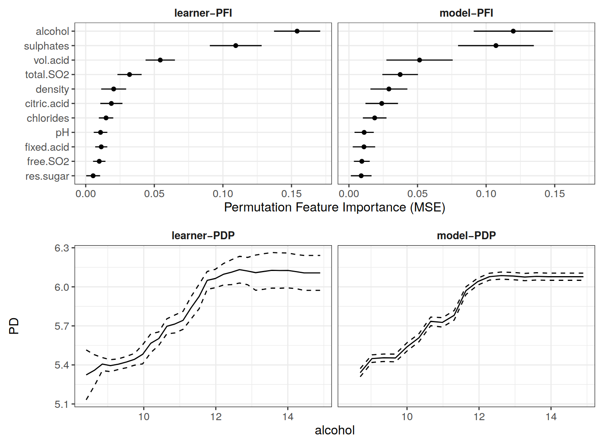

```{r, include = FALSE}
knitr::opts_chunk$set(echo = FALSE,
  warning = FALSE,
  message = FALSE,
  fig.align='center',
  out.width = '90%',
  dev = "CairoPNG")

ggplot2::theme_set(ggplot2::theme_bw(base_size = 15))
```


# Outline

- Introduction
  - Brief History of Interpretability
  - What Is Model-Agnostic Interpretability?
  - Partial Dependence Plot (PDP)
  - Permutation Feature Importance (PFI)
- What I did in my PhD
- Statistical Inference for PDP and PFI

---

## A Brief History of Interpretable Modeling

Interpretable ML has 200 year old roots, but consolidation only started in 2016.
--

- 1800s: Linear regression models

--

- 1960s: Rule-based ML

--

- 2001:  Random Forest

--
- 2012:  Deep Learning Boom kicked off

--

- 2016:  Interpretable ML / Explainable AI boom

???

Now impress audience with history


---

## Interpretable Models

```{r, echo = FALSE}
knitr::include_graphics("../images/white-box.png")
```

???

* Decision trees and decision rules
* Generalized additive models and the whole gang of statistical modeling
* Interpretable models allow interpretation of internal structure and parameters.

---
class: center, middle
background-color: darkgrey

# Model-agnostic Interpretation


---

## Black Box Models


```{r, echo=FALSE}
knitr::include_graphics("../images/black-box.png")
```

Random forest, gradient-boosted trees, neural networks, ...

---


## Model-agnostic Methods

```{r, echo=FALSE}
knitr::include_graphics("../images/agnostic-black-box.png")
```

???

Basic idea: Treat the model as a black box, not allowed to look inside.

Idea very powerful: Allows modularity, works for most models, results are comparable across models

TODO: CITE SIPA paper here


---
class: center, middle
background-color: darkgrey

# Methodological Background

---

## Individual Conditional Expectation (ICE)

How does a feature influence the prediction for an individual observation?

--

```{r, out.width = 500}
load(url("https://github.com/christophM/interpretable-ml-book/blob/master/data/bike.RData?raw=true"))
library("mlr")
library("iml")
library("ggplot2")
library(dplyr)
library(tidyr)

bike.task = makeRegrTask(data = bike, target = "cnt")
mod.bike = mlr::train(mlr::makeLearner(cl = 'regr.randomForest', id = 'bike-rf'), bike.task)

set.seed(42)
bike.sub = bike[sample(1:nrow(bike), size = 15),]

pred.bike = Predictor$new(mod.bike, data = bike.sub)
pdp = FeatureEffect$new(pred.bike, "temp", method = "ice", grid.size = 7)


res.raw = pdp$results
theme_set(theme_classic(base_size = 20))


## Step 1: Define grid over feature
grid.dat = data.frame(temp = unique(res.raw$temp), .id = 1, temp2 = 1)
p = ggplot(grid.dat) + geom_vline(aes(xintercept = temp)) +
  scale_y_continuous("Prediction", limits = c(min(res.raw$.y.hat), max(res.raw$.y.hat))) +
  ggtitle("1) Define grid along feature") +
  scale_x_continuous("Feature")
  #scale_y_continuous("Prediction")
p
```
---

## Individual Conditional Expectation (ICE)

How does a feature influence the prediction for an individual observation?


```{r, out.width = 500}
## Step 2: Get predictions for data set when at grid
grid.dat = data.frame(temp = unique(res.raw$temp))
res.raw$tt = res.raw$temp
p = ggplot(res.raw, aes(x = temp, y = .value)) +
  geom_vline(data = grid.dat, aes(xintercept = temp)) +
  geom_point(aes(color = factor(.id)), size = 3)+
  scale_color_discrete(guide = "none") +
  ggtitle("2) Model predictions at grid points") +
  scale_x_continuous("Feature") +
  scale_y_continuous("Prediction", breaks = NULL)
p
```

---

## Individual Conditional Expectation (ICE)

How does a feature influence the prediction for an **individual data point**?


```{r, out.width = 500}
res.raw$.id2 = factor(res.raw$.id)
p = ggplot(res.raw, aes(x = temp, y = .value))  +
  #geom_vline(aes(xintercept = temp), data = grid.dat) +
  geom_line(aes(group = .id), size  = 1)  +
  geom_point(data = res.raw[c("temp", ".value", ".id2")], aes(color = .id2), size = 3) +
  scale_color_discrete(guide = "none") +
  ggtitle("3) Line per data instance -> ICE curves") +
  scale_x_continuous("Feature") +
  scale_y_continuous("Prediction", breaks = NULL)
p
```
---

## Partial Dependence Plot (PDP)

How does a feature influence the prediction **on average**?

--

```{r, out.width = 500}
p
```

---

## Partial Dependence Plot (PDP)

How does a feature influence the prediction **on average**?

```{r, out.width = 500}
res = res.raw %>% group_by(temp) %>%
  summarize(pdp = mean(.value))

p = ggplot(res) +
  geom_line(aes(x = temp, y = pdp), size = 1.5) +
  geom_point(data = res.raw[c("temp", ".value", ".id2")], aes(color = .id2, x = temp, y = .value), size = 1, alpha = 0.5) +
  ggtitle("4) Average curves to get a PDP") +
  scale_color_discrete(guide = "none") +
  scale_x_continuous("Feature") +
  scale_y_continuous("Prediction", breaks = NULL)
p
```

---


## Partial Dependence Plot (PDP)


The theoretical construct:
$$PD(x) = \mathbb{E}_{X_{C}}[\hat{f}(x, X_{C})]$$

The estimator:
$$\widehat{PD} = \frac{1}{n}\sum_{i=1}^{n} \hat{f}(x, x_{C}^{(i)})$$

---

## Permutation Feature Importance (PFI)

How important is a feature for making correct predictions?


---

## Permutation Feature Importance (PFI)

How important is a feature for making correct predictions?

Idea: Shuffle the feature, and see how much worse the predictions are.

```{r}
knitr::include_graphics("../images/permimp-shuffle.png")
```

---

## Permutation Feature Importance (PFI)


The construct:

$$PFI =  \mathbb{E}_{Y \tilde{X}_S X_C}(L(Y, \hat{f}(\tilde{X}_S, X_C))) - \mathbb{E}_{Y X_S X_C}(L(Y,\hat{f}(X_S, X_C)))$$

The algorithm (simples form):

- Measure original loss $L$ on test data.
- Permute features $X_S$ to get sample $\tilde{X}_S$.
- Get prediction with $\tilde{X}_S$, measure loss again.
- Measure difference between losses.
- Interpretation: PFI is performance drop when "destroying" information about feature.

---
class: middle, center
background-color: darkgrey


# Stuff I Did for My Thesis

---
background-color: lightgrey

## Most Impactful Work

```{r, out.width = 300}
knitr::include_graphics("../images/book.jpg")
```

---

## Not Part of My PhD Though

```{r, out.width = 540}
knitr::include_graphics("../images/academic-credit.jpg")
```

---
background-image:url(../images/thesis-summary.jpeg)
background-size: contain


???

- Consolidation Work
  - Book
  - R package
  - History paper
  - Pitfalls paper
- Improving Methods
  - subgroups
  - iml inference
  - quantifying
- Contributed to
  - MOC
  - relative feature importance
  - SIPA
  - feature importance and PDP (GC)

---
class: center, middle
background-color: darkgrey

# Treating PDP and PFI as Statistical Estimators

---

## Statistical Modeling


```{r, out.width = 500}

```


???

- Assumptions made about the data-generating process
- Mapping between model parameters and properties of data-generating process
- Statistical Inference possible


---

## Linking external tools to DGP

```{r, out.width = 500}

```

???
- For inference, practitioner rely on interpretable models
- But: situations where more flexible models match DGP better (measured in test loss)
- Interpretation possible with PDP and PFI (among others)
- However only describes the model behavior
- Question: Can we link PD and PFI to the DGP? and even do inference?
- Hope: Lift PDP and PFI to status of statistical estimator
- Needed: estimand. A definition of what it is supposed to estimate in the DGP (not the model)
- Idea: PDP and PFI are expectation of a function
- Assumption: True function $f$ exists in DGP
- Then: We can apply same interpretation tools to DGP. Very simple.


---

## Linking External Tools to DGP

```{r, out.width = 500}
knitr::include_graphics("../images/external-dgp-model-mapping.jpeg")
```

---

## Source of uncertainty

```{r, out.width = 900}

```


???

- The ground truth estimand allows use to do the usual statistical estimator stuff:
- For example: Measure MSE
- Or: split up MSE into bias (systematic deviation of estimator to estimand)
- Variance: Two sources in the estimation process:
  - Model is a random variable bc. training data is a sample + model-specific inherent randomness (such as subset sampling in random forests)
  - Expectations are based on Monte carlo sampling

---

## Learner-PD and Learner-PFI

```{r, out.width = 640}

```
---

## One Problem: Variance Underestimation


```{r, out.width = 500}

```

-> Variance correction needed

???

- Variance is underestimated as training data is shared by models.
- Same for test data.
- Underestimating variance also means confidence intervals are too short, appearing more certain than they really are.
- Same problem exists for variance estimates for model performance, as needed for comparing models
- Nadeau et. al (CITE) proposed correction term
- term very naive, but MUCH better than without correction


---

class: small

## References


- Molnar, C., Casalicchio, G., & Bischl, B. (2018). iml: An R package for Interpretable Machine Learning. Journal of Open Source Software, 3, 786.
- Molnar, C.. (2018). Interpretable Machine Learning - A Guide for Making Black Box Models Explainable.
- Molnar, C., Casalicchio, G., & Bischl, B. (2019). Quantifying Model Complexity via Functional Decomposition for Better Post-Hoc Interpretability. In Joint European Conference on Machine Learning and Knowledge Discovery in Databases (pp. 193–204).
- Dandl, S., Molnar, C., Binder, M., & Bischl, B. (2020). Multi-objective counterfactual explanations. In Bäck T. et al. (eds) Parallel Problem Solving from Nature – PPSN XVI. PPSN 2020. Lecture Notes in Computer Science (pp. 448–469).
- Molnar, C., König, G., Bischl, B., & Casalicchio, G. (2020). Model-agnostic Feature Importance and Effects with Dependent Features–A Conditional Subgroup Approach. arXiv preprint arXiv:2006.04628.
- Molnar, C., König, G., Herbinger, J., Freiesleben, T., Dandl, S., Scholbeck, C., Casalicchio, G., Grosse-Wentrup, M., & Bischl, B. (2020). Pitfalls to Avoid when Interpreting Machine Learning Models. In ICML workshop XXAI: Extending Explainable AI Beyond Deep Models and Classifiers.
- Molnar, C. (2013). Recursive partitioning by conditional inference. Department of Statistics, University of Munich: Munich, Germany.
- Molnar, C., Casalicchio, G., & Bischl, B. (2020). Interpretable Machine Learning - A Brief History, State-of-the-Art and Challenges. arXiv preprint arXiv:2010.09337.
- Molnar, C., Freiesleben, T., König, G., Casalicchio, G., Wright, M., & Bischl, B. (2021), Relating Partial Dependence Plot and Permutation Feature Importance to the Data-Generating Process (Working Title). Not even on arxiv yet.
- Casalicchio, G., Molnar, C., & Bischl, B. (2018). Visualizing the feature importance for black box models. In Joint European Conference on Machine Learning and Knowledge Discovery in Databases (pp. 655–670).
- Scholbeck, C., Molnar, C., Heumann, C., Bischl, B., & Casalicchio, G. (2019). Sampling, intervention, prediction, aggregation: A generalized framework for model-agnostic interpretations. arXiv preprint arXiv:1904.03959.
- König, G., Molnar, C., Bischl, B., & Grosse-Wentrup, M. (2021). Relative Feature Importance. In 2020 25th International Conference on Pattern Recognition (ICPR) (pp. 9318–9325).

---

## Thank You for Your Attention

```{r, out.width = 500}

```

