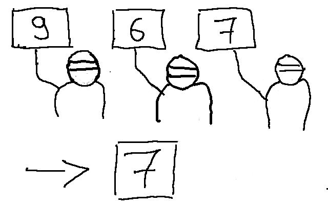
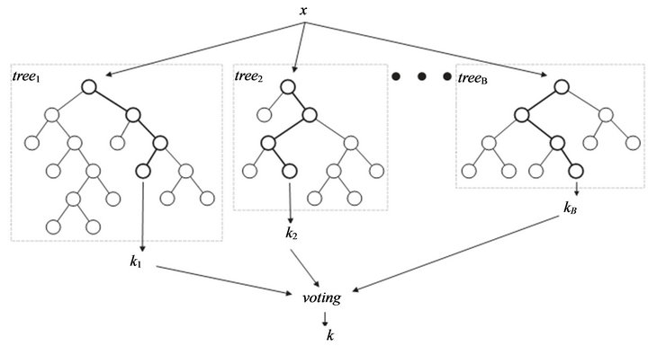
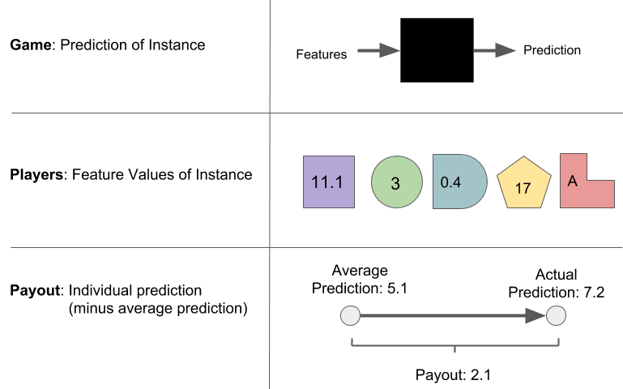

# Let's Predict Wine Quality 


## 
```{r, out.width = "100%"}
knitr::include_graphics("../images/wine-features.jpg")
```

## Disclaimer: I am NOT a wine expert!

```{r, out.width = "50%"}

```

# How can we develop a wine quality prediction program? 

```{r, child="../chunks/what-is-ml.Rmd"}
```

# Step 1: Find data

## Wine Dataset

- 6500 red and white Portuguese "Vinho Verde" wines
- Features: Physicochemical properties
- Quality assessed by blind tasting, from 0 (very bad) to 10 (excellent)

```{r, out.width= "30%"}

```

<font size="2">
P. Cortez, A. Cerdeira, F. Almeida, T. Matos and J. Reis.
Modeling wine preferences by data mining from physicochemical properties. In Decision Support Systems, Elsevier, 47(4):547-553, 2009.</font>

## Wine Quality Distribution

```{r load-data,include=FALSE}
library('patchwork')
library('mlr')
library('ggplot2')
library('tidyr')
library('lime')
devtools::install_github("christophM/iml", ref = "feature-effects")
library('iml')
source('../code/prepare-wine-data.R')
```

```{r show-dist}
ggplot(wine) + 
  geom_bar(aes(x = quality)) + 
  scale_x_continuous("Wine Quality", labels = 1:10, breaks = 1:10)
```


# Step 2: Apply Machine Learning

## Linear Regression {.center data-background=../images/lm.png data-background-size=contain}

## Decision Tree {.center data-background=../images/tree.png data-background-size=contain}

## Random Forest



<font size="2">
Image: 
http://www.hallwaymathlete.com/2016/05/introduction-to-machine-learning-with.html
</font>

## {.center data-background=../images/comp-dog.gif data-background-size=contain}


## Comparing Model Performance


Model performance was measured as mean absolute error using 5-fold cross-validation.

```{r benchmark}
library("mlr")
lrn.ranger = makeLearner("regr.ranger")
lrn.lm = makeLearner("regr.lm")
lrn.rpart = makeLearner("regr.rpart")

rdesc = cv5

lrns = list(lrn.ranger, lrn.lm, lrn.rpart)
test_size = 300
test_index = sample(1:nrow(wine), size = test_size)
wine_test = wine[test_index,]
wine_train = wine[setdiff(1:nrow(wine), test_index), ]

tsk = makeRegrTask(data = wine_train, target = "quality")

bmr = benchmark(lrns, tsk, rdesc, measures = list(mae))
bmr_tab = getBMRAggrPerformances(bmr, as.df = TRUE)
bmr_tab$mae.test.mean = round(bmr_tab$mae.test.mean, 2)
bmr_tab$learner.id[bmr_tab$learner.id == "regr.ranger"] =  "Random Forest"
bmr_tab$learner.id[bmr_tab$learner.id == "regr.lm"] =  "Linear Regression"
bmr_tab$learner.id[bmr_tab$learner.id == "regr.rpart"] =  "Decision Tree"
colnames(bmr_tab) = c("", "Model", "Mean Absolute Error")
knitr::kable(bmr_tab[-1])
```

$$MAE(y,f(X)) = abs(y - f(X))$$

```{r final-model}
mod = train(lrn.ranger, tsk)

set.seed(42)
pred = Predictor$new(mod, data = wine_test, y = "quality")
```


## Prediction vs. Actual Quality

```{r check-model}
preds = pred$predict(wine_test)
preds$actual = wine_test$quality
ggplot(preds, aes(x = actual, y = .prediction, group = actual)) + 
  geom_abline(intercept = 0, slope = 1, lty = 2) +
  geom_violin() +
  scale_x_continuous("Actual quality", 
    labels = 1:10, breaks = 1:10, limit = c(2.5,9.5)) + 
  scale_y_continuous("Predicted quality", labels = 1:10, breaks = 1:10, limits = c(2.5,9.5)) 
#scale_fill_gradient(low = "white", high = "darkblue") + 
```


# Step 3: Profit {.center}

## {data-background=../images/make-it-rain.gif data-background-size=contain}

##  {.emphasizedabit .center data-background=../images/no-idea.gif data-background-size=cover}


## We want to know:

- Which wine properties are the most predictive for quality?
- How does a property affect the predicted wine quality?
- Can we extract a "Rule of Thumb" from the black box?
- Why did a wine get a certain prediction?
- How do we have to change a wine to achieve a different prediction?


##  {.emphasizedabit .center data-background=../images/black-box.gif data-background-size=cover}

<div class="white">
Looking inside the black box
</div>


# Which features are important?

## Permutation Feature Importance

```{r}
knitr::include_graphics("../images/permimp-shuffle.png")
```

1. Measure model error on test data (e.g. MAE)
1. Permute feature of interest
1. Measure model error again
1. Compute difference or ratio

## Permutation Feature Importance

```{r feature-importance}
imp = FeatureImp$new(pred, loss = "mae", compare = "difference")
plot(imp)
```

# How do features affect predictions?


## ICE and PDP

ICE: Individual Conditional Expectation curves

PDP: Partial Dependence Plots

1. Choose a feature
1. Define a grid of values along that feature
1. For each value of the grid
    1. Replace value for all data points the feature value with the grid value
    1. Get the model predictions
1. Draw a line through the grid predictions -> ICE
1. Average the lines -> PDP

## ICE and PDP

```{r,  out.width = '50%'}
knitr::include_graphics("../images/pdp.gif")
```

$$PDP(x) = \frac{1}{n} \sum_{i=1}^n f(x, x_C^{(i)})$$

## Effect of Alcohol
```{r}
eff = FeatureEffect$new(pred, "alcohol", method = 'pdp+ice')
plot(eff)
```

## Effect of Volatile Acidity
```{r}
eff = FeatureEffect$new(pred, "volatile.acidity", method = 'pdp+ice')
plot(eff)
```


## How do features affect predictions?

```{r}
effs = FeatureEffects$new(pred, method = "pdp")
plot(effs, ncols = 4)
```

## Interactions 


```{r, out.width = "100%"}
library("patchwork")
p1 = FeatureEffect$new(pred, method = "pdp", feature = "alcohol")$plot()
p2 = FeatureEffect$new(pred, method = "pdp", feature = "volatile.acidity")$plot()
p3 = FeatureEffect$new(pred, method = "pdp", feature = c("alcohol", "volatile.acidity"))$plot()
(p1 + p2) / p3 + plot_layout(heights = c(1,3))
```


## Interactions (H-Statistic)


H-Statistic tells us how much of the effect of two is due to interactions: $H^2_{jk}= \frac{\sum_{i=1}^n\left[PD_{jk}(x^{(i)})-PD_j(x^{(i)})-PD_k(x^{(i)})\right]^2}{\sum_{i=1}^n{PD}^2_{jk}(x^{(i)})}$

```{r, out.width = "80%"}
ntrct = Interaction$new(pred, feature = "alcohol")
plot(ntrct, ncols = 4)
```


# Rule of thumb for wine quality? 


## Surrogate Model {.center data-background=../images/global-surrogate.png data-background-size=contain}

## Surrogate Model
```{r surrogate}
library(partykit)
tree = TreeSurrogate$new(pred, maxdepth  = 2)
node_inner2 = node_inner(tree$tree, pval = FALSE, id=FALSE)
node_terminal2 = node_boxplot(tree$tree, id = FALSE)
plot(tree$tree, inner_panel = node_inner2, terminal_panel = node_terminal2)

rsquared = tree$r.squared
```

Tree explains `r sprintf("%.2f%s", 100 *  rsquared, "%")` of black box prediction variance.


# Explain individual predictions

```{r bad-wine}
# find bad wine in data
predictions = pred$predict(wine)

min_pred = min(predictions)
max_pred = max(predictions)
worst = wine[which(predictions == min_pred),]
best = wine[which(predictions == max_pred),]
```


## Shapley Value  

```{r}

```


## Explain best wine

```{r}
shap = Shapley$new(pred, x.interest = best)
plot(shap) + 
  scale_x_discrete("") + 
  scale_y_continuous("Feature contribution")
```


##  {.center data-background=../images/bad-wine.gif data-background-size=contain}


## Explain worst wine

```{r}
shap = Shapley$new(pred, x.interest = worst)
plot(shap) + 
  scale_x_discrete("") + 
  scale_y_continuous("Feature contribution")
```

# How Can the Worst Wine be Improved?

## Counterfactual Explanations  {.center data-background=../images/counterfactual-intuition-1.png data-background-size=contain}


## Counterfactual Explanations  {.center data-background=../images/counterfactual-intuition-2.png data-background-size=contain}


## Counterfactual Explanations  {.center data-background=../images/counterfactual-intuition-3.png data-background-size=contain}

## Improve worst wine?

How do we get the wine above predicted quality of 5?

```{r}
worst2 = function(){
  w = worst
  w$volatile.acidity = 0.2
  w
}

worst3 = function(){
  w = worst
  w$alcohol = 13
  w$volatile.acidity = 1
  w
}
```


- Decreasing volatile acidity to 0.2 yields predicted quality of `r sprintf('%.2f', pred$predict(worst2())[[1]])`
- Decreasing volatile acidity to 1.0 and increasing alcohol to 13% yields predicted quality of `r sprintf('%.2f', pred$predict(worst3())[[1]])`


