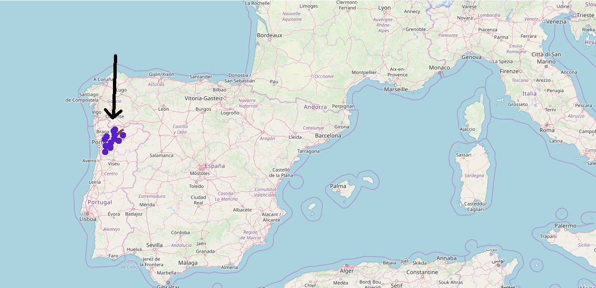

##  {.emphasizedabit}
You want to predict wine quality from its physicochemical properties.

## {.center data-background=../images/wine-features.jpg data-background-size=contain}

## Step 1: Find data
Free dataset of red and white "Vinho Verde" wine.

```{r}

```

Three sensory assessors (using blind tastes), which graded the wine in a scale that ranges from
0 (very bad) to 10 (excellent)

<font size="2">P. Cortez, A. Cerdeira, F. Almeida, T. Matos and J. Reis.
Modeling wine preferences by data mining from physicochemical properties. In Decision Support Systems, Elsevier, 47(4):547-553, 2009.</font>

<!-- Draw: -->
<!-- Volatile acidity as polish remover, pH as pH paper, alchohol as liqour bottle, chlorides as salt prinkler, citric acid as lemon,  -->
<!-- sulfur as mushroom?,  -->

## Step 1: Find data


```{r load-data,include=FALSE}
library('mlr')
library('ggplot2')
library('tidyr')
library('lime')
devtools::install_github("christophM/iml", ref = "feature-effects")
library('iml')
source('../code/prepare-wine-data.R')
```

```{r show-dist}
ggplot(wine) + 
  geom_bar(aes(x = quality)) + 
  scale_x_continuous("Wine Quality", labels = 1:10, breaks = 1:10)
```

# Step 2: Throw ML on your data

##

Compare different models with 10x CV
- Linear regression model
- Decision tree
- Random forest


## {.center data-background=../images/comp-dog.gif data-background-size=contain}


## Step 2: Throw ML on your data

```{r benchmark}
library("mlr")
lrn.ranger = makeLearner("regr.ranger")
lrn.lm = makeLearner("regr.lm")
lrn.rpart = makeLearner("regr.rpart")

rdesc = cv5

lrns = list(lrn.ranger, lrn.lm, lrn.rpart)

tsk = makeRegrTask(data = wine, target = "quality")

bmr = benchmark(lrns, tsk, rdesc, measures = list(mae))
bmr_tab = getBMRAggrPerformances(bmr, as.df = TRUE)
knitr::kable(bmr_tab[-1])
```

=> The random forest (ranger) is the best model.

```{r final-model}
mod = train(lrn.ranger, tsk)

set.seed(42)
sample_size = 500
wine_subset = wine[sample(1:nrow(wine), size = sample_size),]

pred = Predictor$new(mod, data = wine_subset, y = "quality")
```


## Step 2: Throw ML on your data

```{r check-model}

preds = pred$predict(wine)
preds$actual = wine$quality
ggplot(preds, aes(x = actual, y = .prediction, group = actual)) + 
  geom_violin(aes(fill = ..n..)) +
  scale_x_continuous("Actual quality", 
    labels = 1:10, breaks = 1:10) + 
  scale_y_continuous("Predicted quality", labels = 1:10, breaks = 1:10) + 
  scale_fill_gradient(low = "white", high = "darkblue", guide = "none")
```


## {data-background=../images/delivery.gif data-background-size=contain}


# Step 3: Profit {.center}

## {data-background=../images/done-here.gif data-background-size=contain}
```{r, echo=FALSE, out.width='80%', include = FALSE}
knitr::include_graphics("../images/done-here.gif" )
```

##  {.emphasizedabit}

Client: "We would love to learn some insights."


##  {.emphasizedabit .center data-background=../images/black-box.gif data-background-size=cover}

<div class="white">
Looking inside the black box
</div>


## What are the most important features?

TODO: Slide explaining permutation feature importance

## What are the most important features?

```{r feature-importance}
imp = FeatureImp$new(pred, loss = "mae")
plot(imp)
```

## How do features affect predictions?

TODO: Slide explaining ALE plots

## How do features affect predictions?
Method: Accumulated Local Effects
```{r}
eff = FeatureEffect$new(pred, "alcohol", method = 'ale')
plot(eff)
```

## How do features affect predictions?
Method: Accumulated Local Effects
```{r}
eff = FeatureEffect$new(pred, "volatile.acidity", method = 'ale')
plot(eff)
```


## How do features affect predictions?

```{r}
effs = FeatureEffects$new(pred)
plot(effs, ncols = 4)
```

## Interactions between alcohol and volatile acidity?

```{r}
inter = FeatureEffect$new(pred, feature = c("alcohol", "volatile.acidity"))
plot(inter)
```

## Rule of thumb for wine quality? 

```{r surrogate}
library(partykit)
tree = TreeSurrogate$new(pred, maxdepth  = 2)
node_inner2 = node_inner(tree$tree, pval = FALSE, id=FALSE)
node_terminal2 = node_boxplot(tree$tree, id = FALSE)
plot(tree$tree, inner_panel = node_inner2, terminal_panel = node_terminal2)

rsquared = tree$r.squared
```

The tree explains `r sprintf("%.2f%s", 100 *  rsquared, "%")` of the black box prediction variance.


## Exceptionally bad wine

```{r bad-wine}
# find bad wine in data
predictions = pred$predict(wine)

min_pred = min(predictions)
worst = wine[which(predictions == min_pred),]
```

TODO: Image of really bad wine

Predicted quality: `r predictions[which(predictions == min_pred),]`  

## Shapley Value

TODO: Slide to explain Shapley value


## Shapley Value

```{r}
shap = Shapley$new(pred, x.interest = worst)
plot(shap)
```

## What needs to change?

TODO: Slide to explain counterfactuals


## Counterfactual explanation

How do we get the wine above predicted quality of 5?

```{r}
worst

worst2 = function(){
  w = worst
  w$volatile.acidity = 0.2
  w
}

pred$predict(worst2())[[1]]


worst3 = function(){
  w = worst
  w$alcohol = 13
  w$volatile.acidity = 1
  w
}

pred$predict(worst3())[[1]]
```


TODO: Image 

- Decreasing volatile acidity to 0.2 yields predicted quality of `r sprintf('%.2f', pred$predict(worst2())[[1]])`
- Decreasing volatile acidity to 1.0 and increasing alcohol to 13% yields predicted quality of `r sprintf('%.2f', pred$predict(worst3())[[1]])`


