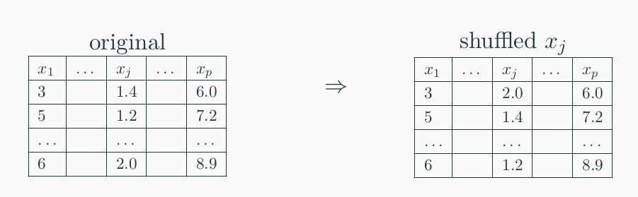
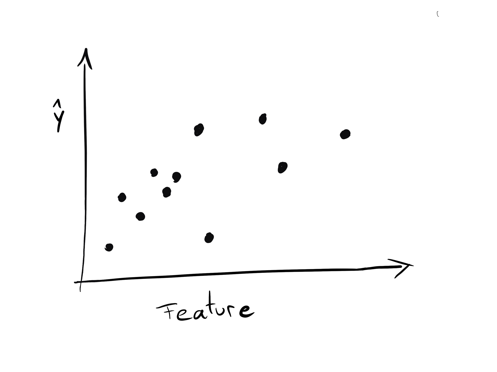
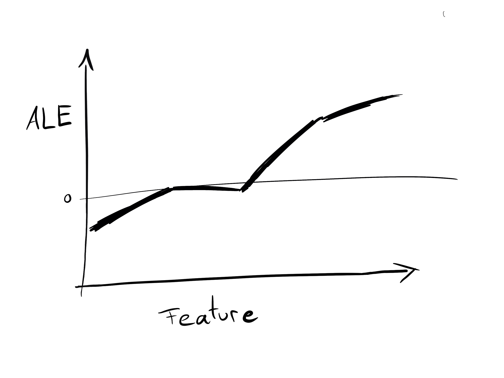

##  {.emphasizedabit}
Predict wine quality from its physicochemical properties.

## {.center data-background=../images/minho.png data-background-size=contain}

## Wine Dataset

- 6500 red and white Portuguese "Vinho Verde" wines
- Features: Physicochemical properties
- Quality assessed by blind tasting, from 0 (very bad) to 10 (excellent)

```{r, out.width= "30%"}
knitr::include_graphics("../images/judges.png")
```

<font size="2">
P. Cortez, A. Cerdeira, F. Almeida, T. Matos and J. Reis.
Modeling wine preferences by data mining from physicochemical properties. In Decision Support Systems, Elsevier, 47(4):547-553, 2009.</font>


## {.center data-background=../images/wine-features.jpg data-background-size=contain}

## Disclaimer: I am NOT a wine expert!

```{r, out.width = "50%"}

```


## Quality Distribution


```{r load-data,include=FALSE}
library('mlr')
library('ggplot2')
library('tidyr')
library('lime')
devtools::install_github("christophM/iml", ref = "feature-effects")
library('iml')
source('../code/prepare-wine-data.R')
```

```{r show-dist}
ggplot(wine) + 
  geom_bar(aes(x = quality)) + 
  scale_x_continuous("Wine Quality", labels = 1:10, breaks = 1:10)
```

# How can we solve this problem?

```{r, child="../chunks/what-is-ml.Rmd"}
```

# Step 1: Find data

## 
```{r}
knitr::include_graphics("../images/checkmark.png")
```

# Step 2: Apply Machine Learning

## Random Forest


<font size="2">
Image: 
http://www.hallwaymathlete.com/2016/05/introduction-to-machine-learning-with.html
</font>

## {.center data-background=../images/comp-dog.gif data-background-size=contain}

```{r benchmark}
library("mlr")
lrn.ranger = makeLearner("regr.ranger")
lrn.lm = makeLearner("regr.lm")
lrn.rpart = makeLearner("regr.rpart")

rdesc = cv5

lrns = list(lrn.ranger, lrn.lm, lrn.rpart)

tsk = makeRegrTask(data = wine, target = "quality")

bmr = benchmark(lrns, tsk, rdesc, measures = list(mae))
bmr_tab = getBMRAggrPerformances(bmr, as.df = TRUE)
#knitr::kable(bmr_tab[-1])
```


```{r final-model}
mod = train(lrn.ranger, tsk)

set.seed(42)
sample_size = 500
wine_subset = wine[sample(1:nrow(wine), size = sample_size),]

pred = Predictor$new(mod, data = wine_subset, y = "quality")
```


## Train Random Forest to Predict Quality {.emphasizedabit}

Mean absolute error on test data (cross-validated): `r sprintf('%.2f', bmr_tab$mae.test.mean[bmr_tab$learner.id == "regr.ranger"])`

## Prediction vs. Actual Quality

```{r check-model}
preds = pred$predict(wine)
preds$actual = wine$quality
ggplot(preds, aes(x = actual, y = .prediction, group = actual)) + 
  geom_abline(intercept = 0, slope = 1, lty = 2) +
  geom_violin() +
  scale_x_continuous("Actual quality", 
    labels = 1:10, breaks = 1:10, limit = c(2.5,9.5)) + 
  scale_y_continuous("Predicted quality", labels = 1:10, breaks = 1:10, limits = c(2.5,9.5)) 
#scale_fill_gradient(low = "white", high = "darkblue") + 
```


# Step 3: Profit {.center}

## {data-background=../images/make-it-rain.gif data-background-size=contain}

##  {.emphasizedabit .center data-background=../images/no-idea.gif data-background-size=cover}


## We want to know:

- Which wine properties are the most predictive for quality?
- How does a property affect the predicted wine quality?
- Can we extract a "Rule of Thumb" from the black box?
- Why did a wine get a certain prediction?
- How do we have to change a wine to achieve a different prediction?


##  {.emphasizedabit .center data-background=../images/black-box.gif data-background-size=cover}

<div class="white">
Looking inside the black box
</div>


## Which features are important?

## Permutation Feature Importance

```{r}

```

## Which features are important?

```{r feature-importance}
imp = FeatureImp$new(pred, loss = "mae")
plot(imp)
```

## How do features affect predictions?

## Accumulated Local Effects

```{r,  out.width = '78%'}

```

## Accumulated Local Effects

```{r,  out.width = '78%'}
knitr::include_graphics("../images/ale-intuition-2.jpg")
```

## Accumulated Local Effects

```{r,  out.width = '78%'}
knitr::include_graphics("../images/ale-intuition-3.jpg")
```

## Accumulated Local Effects
```{r,  out.width = '78%'}
knitr::include_graphics("../images/ale-intuition-4.jpg")
```

## Accumulated Local Effects
```{r,  out.width = '78%'}

```


## Effect of Alcohol
```{r}
eff = FeatureEffect$new(pred, "alcohol", method = 'ale')
plot(eff)
```

## Effect of Volatile Acidity
```{r}
eff = FeatureEffect$new(pred, "volatile.acidity", method = 'ale')
plot(eff)
```


## How do features affect predictions?

```{r}
effs = FeatureEffects$new(pred)
plot(effs, ncols = 4)
```


## Rule of thumb for wine quality? 


## Surrogate Model {.center data-background=../images/global-surrogate.png data-background-size=contain}

## Surrogate Model
```{r surrogate}
library(partykit)
tree = TreeSurrogate$new(pred, maxdepth  = 2)
node_inner2 = node_inner(tree$tree, pval = FALSE, id=FALSE)
node_terminal2 = node_boxplot(tree$tree, id = FALSE)
plot(tree$tree, inner_panel = node_inner2, terminal_panel = node_terminal2)

rsquared = tree$r.squared
```

Tree explains `r sprintf("%.2f%s", 100 *  rsquared, "%")` of black box prediction variance.


## Explain individual predictions

```{r bad-wine}
# find bad wine in data
predictions = pred$predict(wine)

min_pred = min(predictions)
max_pred = max(predictions)
worst = wine[which(predictions == min_pred),]
best = wine[which(predictions == max_pred),]
```


## Shapley Value  

```{r}
knitr::include_graphics("../images/shapley-intuition-1.png")
```


## Explain best wine

```{r}
shap = Shapley$new(pred, x.interest = best)
plot(shap) + 
  scale_x_discrete("") + 
  scale_y_continuous("Feature contribution")
```


##  {.center data-background=../images/bad-wine.gif data-background-size=contain}


## Explain worst wine

```{r}
shap = Shapley$new(pred, x.interest = worst)
plot(shap) + 
  scale_x_discrete("") + 
  scale_y_continuous("Feature contribution")
```

## Improve worst wine?

## Counterfactual Explanations  {.center data-background=../images/counterfactual-intuition-1.png data-background-size=contain}


## Counterfactual Explanations  {.center data-background=../images/counterfactual-intuition-2.png data-background-size=contain}


## Counterfactual Explanations  {.center data-background=../images/counterfactual-intuition-3.png data-background-size=contain}

## Improve worst wine?

How do we get the wine above predicted quality of 5?

```{r}
worst2 = function(){
  w = worst
  w$volatile.acidity = 0.2
  w
}

worst3 = function(){
  w = worst
  w$alcohol = 13
  w$volatile.acidity = 1
  w
}
```


- Decreasing volatile acidity to 0.2 yields predicted quality of `r sprintf('%.2f', pred$predict(worst2())[[1]])`
- Decreasing volatile acidity to 1.0 and increasing alcohol to 13% yields predicted quality of `r sprintf('%.2f', pred$predict(worst3())[[1]])`


