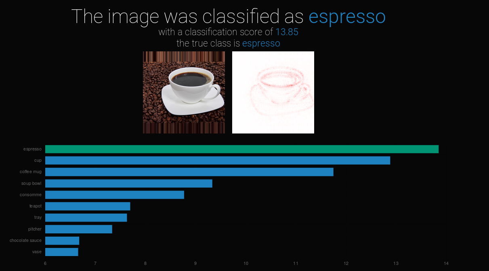
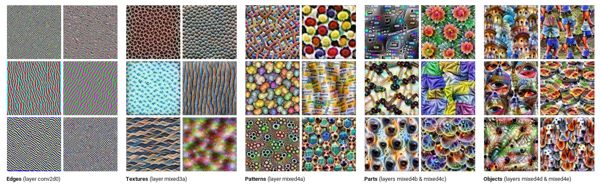
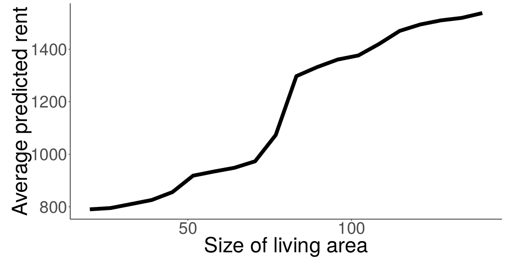

# What tools do we have?


## Interpretable Models

```{r, echo = FALSE}
knitr::include_graphics("../images/black-box.png")
```

## Interpretable Models

```{r, echo=FALSE}
knitr::include_graphics("../images/white-box.png")
```

<div class="notes">
- Decision trees
- Decision rules
- Generalized regression models
- ...
</div>

## Intepretable Model: Linear Regression {.center data-background=../images/lm.png data-background-size=contain}

## Intepretable Model: Decision Tree {.center data-background=../images/tree.png data-background-size=contain}

## Interpretable Model: Decision Rules {.emphasizedabit}

IF $90m^2\leq \text{size} < 110m^2$  AND location $=$ "good" THEN rent is between 1540 and 1890 EUR


## Model-specific Methods

```{r, echo=FALSE}
knitr::include_graphics("../images/black-box.png")
```


## Model-specific Methods

```{r, echo=FALSE}
knitr::include_graphics("../images/specific-black-box.png")
```

## Model-specific Methods
Layerwise Relevance Propagation (LRP)

```{r, echo=FALSE}

```


<font size="2">
Bach, Sebastian, et al. "On pixel-wise explanations for non-linear classifier decisions by layer-wise relevance propagation." PloS one 10.7 (2015): e0130140.
</font>


## Model-specific Methods

```{r, echo=FALSE}

```

<font size="2">
https://distill.pub/2017/feature-visualization/
</font>


## Model-agnostic Methods

```{r, echo=FALSE}
knitr::include_graphics("../images/black-box.png")
```


## Model-agnostic Methods

```{r, echo=FALSE}
knitr::include_graphics("../images/agnostic-black-box.png")
```

## Model-agnostic Methods

```{r}

```

## Model-agnostic Methods: Global Surrogate {.center data-background=../images/global-surrogate.png data-background-size=contain}

## Model-agnostic Methods: Local Surrogate {.center data-background=../images/local-surrogate.png data-background-size=contain}


## Example-focused Methods

TODO: Graphic for counterfactuals

