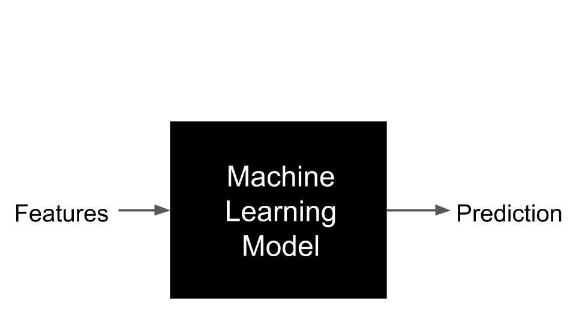
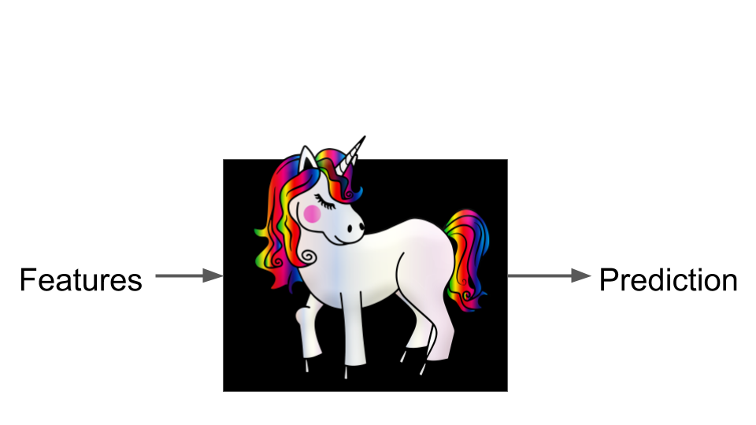

## Programing vs. Machine Learning  {.center data-background=../images/programing-ml.png data-background-size=contain}


## Statistics vs. Machine Learning {.emphasizedabit}

linear $\Rightarrow$ non-linear

additive $\Rightarrow$ interactions

theory-driven $\Rightarrow$ optimization-driven


## Machine Learning (supervised)

```{r, echo=FALSE}

```

## Machine Learning (supervised)

```{r, echo=FALSE}

```

## Machine Learning (supervised)

```{r, echo=FALSE}
knitr::include_graphics("../images/black-box.png")
```
