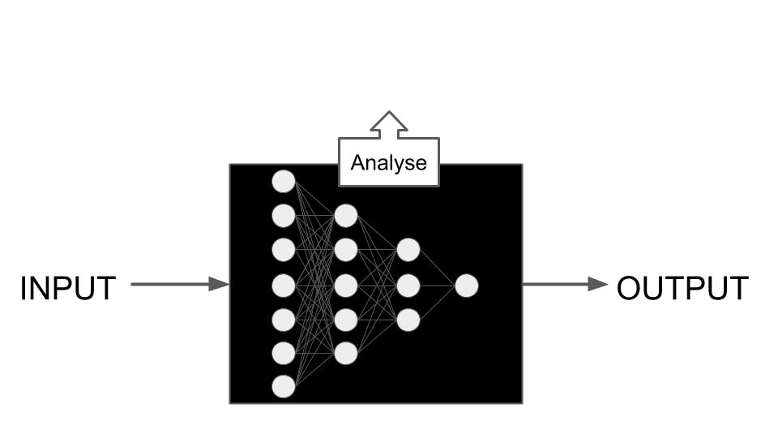
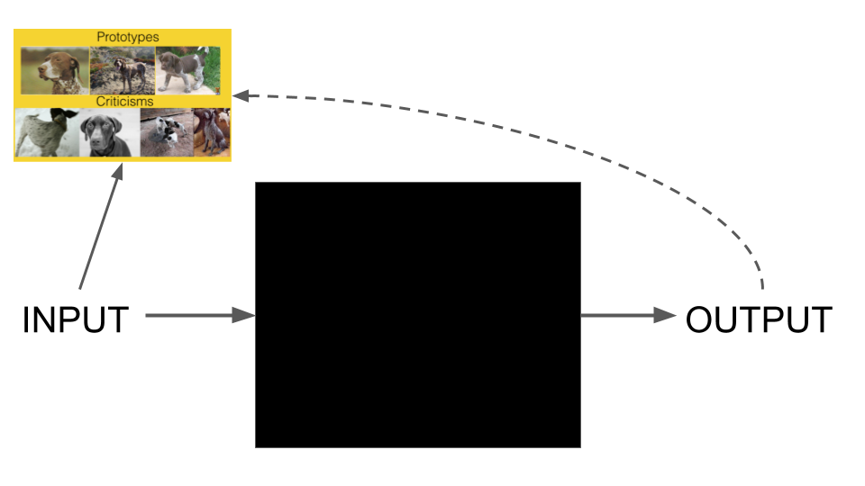

```{r, include = FALSE}
knitr::opts_chunk$set(echo = FALSE, 
  warning = FALSE,
  message = FALSE, 
  fig.align='center', 
  out.width = '100%')
```

##  {.emphasizedabit}
A client wants you to predict data scientist salaries with machine learning.  

## {.center data-background=images/wow.jpg data-background-size=contain}


# Let's predict data scientist salaries


# What is Machine Learning?

<div class="notes">
Machine learning is a method for teaching computers to make and improve predictions or behaviours based on data.
</div>

## {data-background=images/magic.jpg data-background-size=contain}


# Step 1: Find some data


## Step 1: Find some data

Kaggle conducted an industry-wide survey of data scientists. 
https://www.kaggle.com/kaggle/kaggle-survey-2017

Information asked:  

- Compensation
- Demographics
- Job title
- Experience
- ...


<font size="2">Contains information from Kaggle ML and Data Science Survey, 2017, which is made available here under the Open Database License (ODbL).</font>


```{r load-data,include=FALSE}
library('mlr')
library('ggplot2')
library('tidyr')
library('lime')
source('code/prepare-kaggle-data.R')
```


# Step 2: Throw ML on your data

```{r learn}
library('mlr')
set.seed(42)
task = makeRegrTask(data = survey.dat, target = 'CompensationAmount')
lrn = makeLearner('regr.randomForest')
mod = train(lrn, task)
```


## {.center data-background=images/comp-dog.gif data-background-size=contain}

<div class="notes">
- Random Forest
- Target: Compensation
- All features that you found in the data
- Train, test, ship
</div>

# Step 3: Profit {.center}

## {data-background=images/done-here.gif data-background-size=contain}
```{r, echo=FALSE, out.width='80%', include = FALSE}
knitr::include_graphics("images/done-here.gif" )
```

##  {.emphasizedabit}

Client: "There is a problem with the model!"

##  {.emphasizedabit .center data-background=images/Hide-the-pain-harold-phone.jpg data-background-size=cover}

"What problem?"

```{r, echo=FALSE, out.height='50%', include=FALSE}
knitr::include_graphics("images/Hide-the-pain-harold-phone.jpg")
```


## {.emphasizedabit}

Client: "Model predicts high salaries for old yet unskilled people."

```{r, echo=FALSE, fig.width=16, include=FALSE}
knitr::include_graphics("images/age.jpeg")
```

##  {.emphasizedabit .center data-background=images/black-box.gif data-background-size=cover}

<div class="white">
Looking inside the black box
</div>

# How do the features influence my predictions?

## Partial Dependence Plot

```{r out.width="80%"}
library("iml")
X = survey.dat[-which(names(survey.dat) == "CompensationAmount")]
predictor = Predictor$new(mod, data = X, y = getTaskTargets(task))
pd = Partial$new(predictor, feature ='Age')
pd$plot() 
```


<font size="2">Goldstein, A., Kapelner, A., Bleich, J., & Pitkin, E. (2013). Peeking Inside the Black Box: Visualizing Statistical Learning with Plots of Individual Conditional Expectation, 1–22. https://doi.org/10.1080/10618600.2014.907095 </font>

<font size="2">Friedman, J. H. (1999). Greedy Function Approximation : A Gradient Boosting Machine. North, 1(3), 1–10. https://doi.org/10.2307/2699986 </font>

<div class="notes">
- PDP answers: How does the prediction change when a feature input changes?
- Average of ICE curves
</div>


##  {.emphasizedabit}

Client: "We want to understand the model better!"

# What are the most important features?

## Permutation feature importance

```{r, warning=FALSE}
feat.imp = FeatureImp$new(predictor, loss = 'mae')
feat.imp$plot()
```

<font size="2">Breiman, Leo. "Random forests." Machine learning 45.1 (2001): 5-32. </font>

## Gender?! {.emphasizedabit .center data-background=images/big-mistake.png data-background-size=contain}

```{r, echo=FALSE, out.width='80%', include=FALSE}
knitr::include_graphics("images/big-mistake.png")
```

# What's the influence of gender on the prediction?

## 

```{r}
pdp = Partial$new(predictor, feature="Gender")
pdp$plot() 
```


## {.center data-background=images/hidden-pain-bias.jpg data-background-size=contain}

```{r, echo=FALSE, include = FALSE}
knitr::include_graphics("images/hidden-pain-bias.jpg")
```

## {.center data-background=images/angry.gif data-background-size=contain}

```{r, echo=FALSE, out.width='40%', include = FALSE}
knitr::include_graphics("images/angry.gif")
```

# Explaining individual predictions


# Local Models (LIME)

## {.center data-background=images/lime-fitting-1.png data-background-size=contain}

## 
```{r, echo=FALSE}
set.seed(44)
```


```{r}
explanation = LocalModel$new(predictor)
explanation$explain(X[15, ])
explanation$plot()
```


<font size="2">Ribeiro, M. T., Singh, S., & Guestrin, C. (2016). “Why Should I Trust You?”: Explaining the Predictions of Any Classifier. Retrieved from http://arxiv.org/abs/1602.04938</font>


# Some Theory


## The Problem 

```{r, echo=FALSE, fig.align='center'}
knitr::include_graphics("images/black-box.png")
```
<div class="notes">
- Opaque decision making by machine learning algorithms
- Bias and mistakes in the data
- Trust as a user: Should I start a therapy with sever side effects, because the machine said so?
- Debugging as a practitioner: Why did the algorithm miss-classify sample X? Did it learn generalizable features? 
</div>


# When do we need interpretability?


## {.center data-background=images/credit.jpg data-background-size=cover}

## {.center data-background=images/pill.jpg data-background-size=cover}

## {.center data-background=images/death.jpg data-background-size=cover}

## {.center data-background=images/people.jpg data-background-size=cover}


<div class="notes">
We need interpretability when the loss function does not cover all constraints. 

- Decisions about humans.
- Critical applications that decide about life and death.
- Newly developed systems with unknown consequences.
- Models using proxies instead of causal inputs.
- Debugging the models.
- Increasing trust.
</div>


# When do we NOT need interpretability?


##  {.center data-background=images/mnist.jpeg data-background-size=cover}

<div class="notes">
When we can capture everything in the loss function and the data collection.
only causal relationships.
perfect operationalization of features.

Things that work well. 
Well defined problems
</div>


# What tools do we have?

<div class="notes">
- Intrinsically interpretable models
- Tools for analyzing specific black box models
- Model-agnostic tools: analysing any black box model
- Interpretability through making data explainable
</div>


## Interpretable Models

```{r, echo = FALSE}
knitr::include_graphics("images/black-box.png")
```

## Interpretable Models

```{r, echo=FALSE}
knitr::include_graphics("images/white-box.png")
```

<div class="notes">
- Decision trees
- Decision rules
- Generalized regression models
- ...
</div>


## Model-specific methods

```{r, echo=FALSE}
knitr::include_graphics("images/black-box.png")
```


## Model-specific methods

```{r, echo=FALSE}

```

<div class="notes">
- Visualizing activations of neural networks
- Random Forest specific feature importance
- xgboost explainer
- problem: new models, not comparable between models, missing flexibility
</div>


## Model-agnostic methods

```{r, echo=FALSE}
knitr::include_graphics("images/black-box.png")
```


## Model-agnostic methods

```{r, echo=FALSE}
knitr::include_graphics("images/agnostic-black-box.png")
```

<div class="notes">
- Partial dependence plots
- LIME
- ...
</div>


## Example-focused methods

```{r, echo=FALSE}
knitr::include_graphics("images/black-box.png")
```


## Example-focused methods
```{r, echo=FALSE}

```

<div class="notes">
- Prototypes: What is the prototype of a certain class
- Criticisms: Which data points are unusual for a certain class. 
- Counterfactuals: What do I need to change for an instance to change the prediction?
- Anchors: What features do I have to anchor to keep prediction the same?
</div>


## Interested in learning more? 

Read my book about "Interpretable Machine Learning"
https://christophm.github.io/interpretable-ml-book/

```{r, echo=FALSE, fig.align='center', out.width='30%'}
knitr::include_graphics("images/book.jpg")
```

# Backup slides

# What is interpretability?

<div class="notes">
Interpretability is the degree to which a human can understand the cause of a decision. 
But we don't really have a good way to measure that really. Not as easy as benchmarking ML algorithms. 

Interpretability is also a mean to look at the data and possible issues with them.

<font size="2">Miller, Tim. 2017. “Explanation in Artificial Intelligence: Insights from the Social Sciences.” arXiv Preprint arXiv:1706.07269.</font>
</div>

# Statistical Modeling: The Two Cultures

<div class="notes">
Paper by Leo Breiman (Random Forest)
data modeling culture (statistics) vs algorithmic modeling culture (ml)
tradeoff between interpretability and predictive performance
example: tree vs. random forest, logistic regression vs. neural network
</div>

# What makes an explanation human-friendly?

<div class="notes">
short: 1-2 causes
counterfactual: compares to other output
truthful
social context
consistent with prior beliefs
probable
focuses on abnormal causes
</div>


# Shapley Value

## {.center data-background=images/team.jpg data-background-size=contain}


## 
```{r}
set.seed(44)
```


```{r}
explanation = Shapley$new(predictor)
explanation$explain(X[15, ])
explanation$plot()
```
