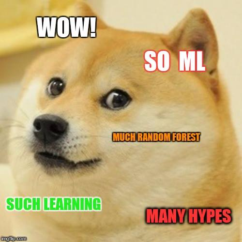
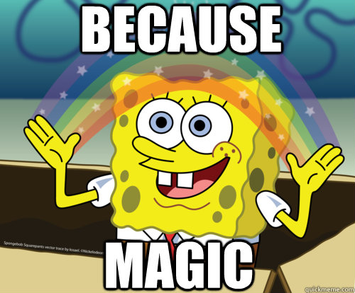
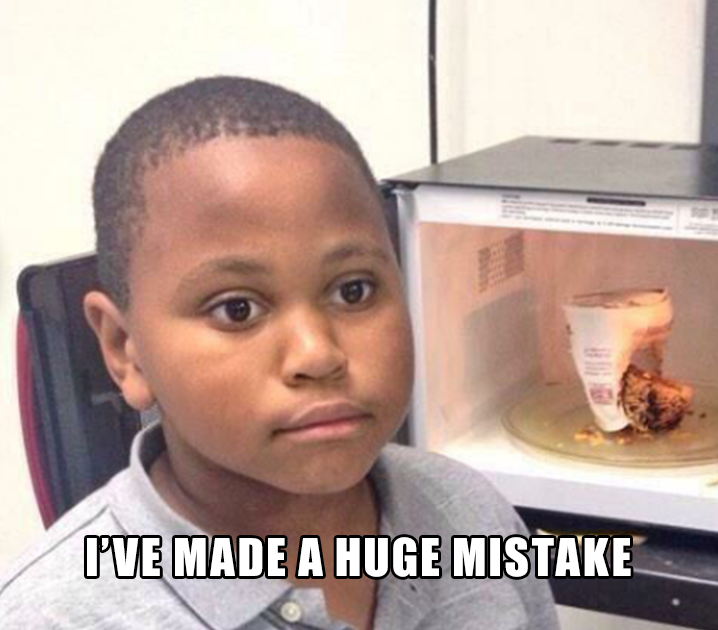
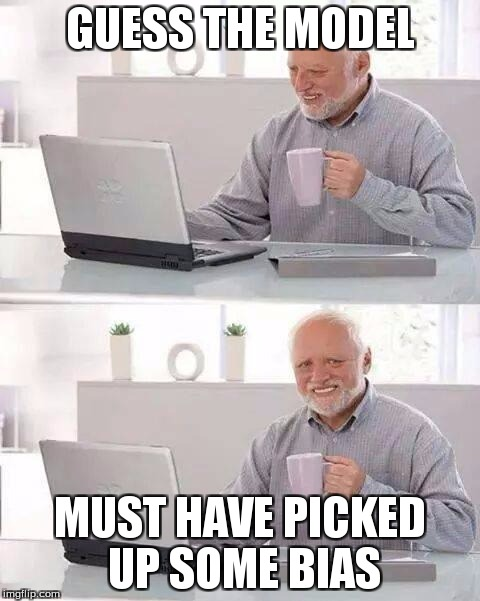
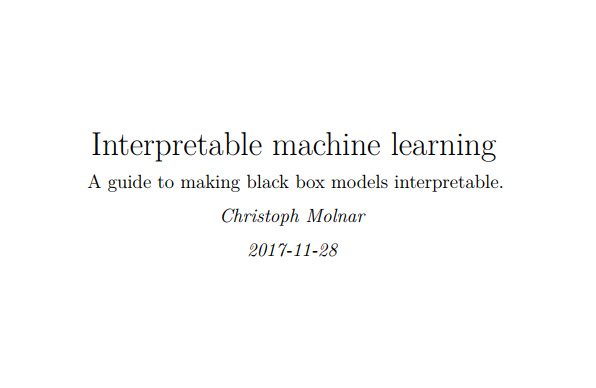

##  {.emphasizedabit}
Scenario: A company approaches you to predict data scientist salaries with machine learning.  

##

```{r, echo=FALSE, fig.align='center'}

```

# Let's predict data scientist salaries


## What is Machine Learning

Machine learning is a method for teaching computers to make and improve predictions or behaviours based on data.

```{r, echo=FALSE, fig.align='center'}

```


## Step 1: Find some data
Kaggle conducted an industry-wide survey of data scientists. 
https://www.kaggle.com/kaggle/kaggle-survey-2017

Information asked:  

- Compensation
- Demographics
- Job title
- Experience
- ...


<font size="2">Contains information from Kaggle ML and Data Science Survey, 2017, which is made available here under the Open Database License (ODbL).</font>


```{r load-data, warning=FALSE, include=FALSE}
library('mlr')
library('ggplot2')
library('tidyr')
library('lime')
source('code/prepare-kaggle-data.R')
```


## Step 2: Throw ML on your data
```{r learn, warning=FALSE}
library('mlr')
set.seed(42)
task = makeRegrTask(data = survey.dat, target = 'CompensationAmount')
lrn = makeLearner('regr.gbm', interaction.depth = 4, n.trees = 500)
mod = train(lrn, task)
```
## Step 3: Profit. {.center}

```{r, echo=FALSE, out.width='70%', fig.align='center'}

```

##  {.emphasizedabit}

"There is a problem with the model!"

## What problem?

```{r, echo=FALSE, out.width='100%', fig.align='center'}

```


## "The older the applicants, the higher the predicted salary, regardless of skills."
```{r, echo=FALSE, out.height='100%', fig.align='center'}

```


# Individual Conditional Expectation

##

```{r}
library("iml")
X = survey.dat[-which(names(survey.dat) == "CompensationAmount")]
predictor = Predictor$new(mod, data = X, y = getTaskTargets(task))
ice = Partial$new(predictor, feature ='Age')
ice$plot()
```


<font size="2">Goldstein, A., Kapelner, A., Bleich, J., & Pitkin, E. (2013). Peeking Inside the Black Box: Visualizing Statistical Learning with Plots of Individual Conditional Expectation, 1–22. https://doi.org/10.1080/10618600.2014.907095 </font>

## 

```{r}
ice$center(20)$plot()
```


# Partial dependence plots

##

```{r}
pdp = PartialDependence$new(predictor, feature = "Age")
pdp$plot()
```

<font size="2">Friedman, J. H. (1999). Greedy Function Approximation : A Gradient Boosting Machine. North, 1(3), 1–10. https://doi.org/10.2307/2699986 </font>


##  {.emphasizedabit}

"We want to understand the model better!"

# Permutation feature importance

##

```{r, warning=FALSE}
feat.imp = FeatureImp$new(predictor, loss = 'mae')
feat.imp$plot()
```

<font size="2">Breiman, Leo. "Random forests." Machine learning 45.1 (2001): 5-32. </font>

## Gender?!
```{r, echo=FALSE, fig.align='center', out.width='80%'}

```

##

```{r}
pdp = PartialDependence$new(predictor, feature="Gender")
pdp$plot() 
```

## 

```{r, echo=FALSE, fig.align='center', out.width='100%'}

```

##

```{r, echo=FALSE, fig.align='center'}

```

##

```{r, echo=FALSE, fig.align='center', out.width='40%'}

```


# LIME

## 
```{r, echo=FALSE, fig.align='center'}
set.seed(44)
```


```{r, echo=TRUE, fig.align='center', message = FALSE}
explanation = LocalModel$new(predictor)
explanation$explain(X[5, ])$plot()
```


<font size="2">Ribeiro, M. T., Singh, S., & Guestrin, C. (2016). “Why Should I Trust You?”: Explaining the Predictions of Any Classifier. Retrieved from http://arxiv.org/abs/1602.04938</font>

# Shapley

## 
```{r, echo=FALSE, fig.align='center'}
set.seed(44)
```


```{r, echo=TRUE, fig.align='center'}
explanation = Shapley$new(predictor)
explanation$explain(X[5, ])$plot()
```

## Interested in learning more?

Read my book about "Interpretable Machine Learning"
https://christophm.github.io/interpretable-ml-book/

```{r, echo=FALSE, fig.align='center', out.width='80%'}

```

